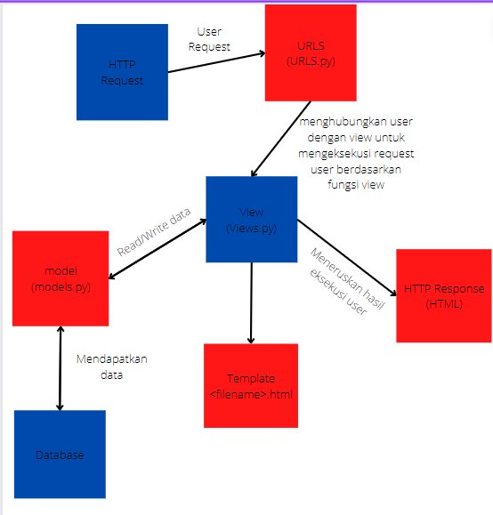

link
https://tugas2teukugevin.herokuapp.com/katalog/

Buatlah bagan yang berisi request client ke web aplikasi berbasis Django beserta responnya dan jelaskan pada bagan tersebut kaitan antara 
urls.py, views.py, models.py, dan berkas html;

Jelaskan kenapa menggunakan virtual environment? Apakah kita tetap dapat membuat aplikasi web berbasis Django tanpa menggunakan virtual environment?
- Virtual environment adalah sebuah wadah untuk menampung pustaka serta modul dalam suatu proyek pekerjaan agar terisolasi. Virtual environment sendir harus
digunakan supaya ketika mengupdate versi django , app yang sudah kita buat dengan django sebelumnya dengan modul-modul veri sebelumnya tetap bisa berjalan
tanpa harus mengikuti modul-modul jika diperbaharui, jadi seperti terisolasi dan ini sangat memudahkan kita tanpa harus perbaharui terus mengikuti versi. Django
masih tetap berjalan tanpa menggunakan virtual environment, tapi seperti dijelaskan sebelumnya, kerjanya akan capek apa lagi membuka app tersebut di laptop orang
jika versi Django-nya berbeda dengan kita punya

Jelaskan bagaimana cara kamu mengimplementasikan poin 1 sampai dengan 4 di atas. 
- Membuat sebuah fungsi pada views.py yang dapat melakukan pengambilan data dari model dan dikembalikan ke dalam sebuah HTML.
ini di perlukan "from django.shortcuts import render" supaya bisa memakai render untuk di tampilkan di html-nya, dan juga import models untuk pakai class/fungsi
yang diperlukan untuk di tampilkan di html, di program ini veiws.py import "from katalog.models import CatalogItem" dan fungsi yang dibuat adalah

def show_katalog(request):
    data_barang_katalog = CatalogItem.objects.all()
    context = {
        'list_barang': data_barang_katalog,
        'nama': 'Teuku Gevin Taufan',
        'student_id': '2106750194',
    }
    return render(request, "katalog.html", context)

"data_barang_katalog = CatalogItem.objects.all()" untuk mengambil data dari CatalogItem di models

di dalam context sendiri ini untuk data ditampilkan di html dan tambah "return render(request, "katalog.html", context)"

-Membuat sebuah routing untuk memetakan fungsi yang telah kamu buat pada views.py
sebuah routing dibuat di urls.py dengan cara

from django.urls import path
from katalog.views import show_katalog

app_name = 'katalog'

urlpatterns = [
    path('', show_katalog, name='show_katalog'),
]

routing ini berguna untuk halaman HTML dapat ditampilkan lewat browser

-Memetakan data yang didapatkan ke dalam HTML dengan sintaks dari Django untuk pemetaan data template.
dengan cara {{data}} seperti katalog.html contoh 

  <h5>Name: </h5>
  
{{nama}}

  <h5>Student ID: </h5>
  
{{student_id}}

-Melakukan deployment ke Heroku terhadap aplikasi yang sudah kamu buat sehingga nantinya dapat diakses oleh teman-temanmu melalui Internet.
ini ke heroku masuk menggunakan akun sendiri dan buat new app dengan nama apa aja dan copy nama tersebut dan juga copy API key untuk menghubungkan
ke github repo kita yang sudah di push tadi. Di github repo kita tadi pergi ke setting, secrets, action, dan new secrets. Tambah HEROKU_APP_NAME : nama dibuat
dan HEROKU_API_KEY : API Key heroku kita. Setelah itu paksa run deploy dan bisa