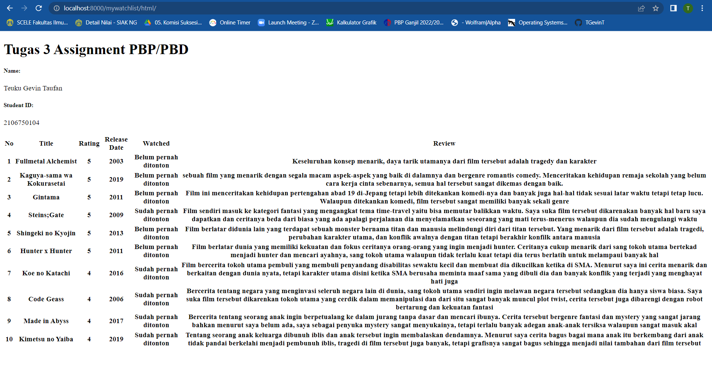
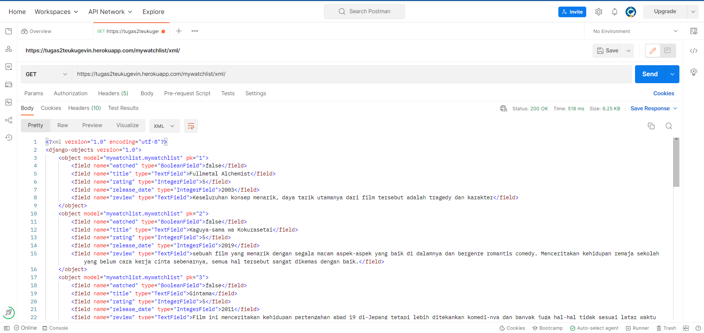

-Jelaskan perbedaan antara JSON, XML, dan HTML!
    - Yang pertama adalah cara menyimpan elemen,  JSON menyimpan elemennya secara efisien akan tetapi tidak rapi untuk dilihat. Sedangkan XML menyimpan 
    elemen-elemen nya dengan cara yang terstruktur, mudah dibaca oleh manusia dan mesin, akan tetapi kurang efisien, dan HTML lebih difokuskan tampilan 
    atau dengan kata lain jembatan untuk menyalurkan data dari user ke database atau database ke user dan sangat tidak disarankan penyimpan data di HTML.

    - kedua ada ekstensi file, nama dari file JSON akan diakhiri dengan ekstensi .json. Sementara file XML akan diakhiri dengan ekstensi .xml. Sedangkan
    HTML diakhir dengan .html.

    - ketiga penerapannya. Untuk penerapannya, JSON digunakan untuk mengirimkan data dengan cara data diuraikan dan dikirimkan melalui internet. Sedangkan 
    XML memiliki data yang lebih terstruktur dan pengguna dapat menggunakannya untuk menambahkan catatan. Dan HTMl sendiri digunakan untuk mengelola serangkaian
    data dan informasi sehingga suatu dokumen dapat diakses dan ditampilkan di Internet melalui layanan web

-Jelaskan mengapa kita memerlukan data delivery dalam pengimplementasian sebuah platform?
    Data delivery sangat diperlukan supaya menghubungkan data base dan appearance. Pasalnya menyimpan di satu tempat saja seperti di appearance(html gitu dan lain-lain) akan 
    menyebabkan data tidak terstruktur dan sangat banyak sekali kode yang perlu di kerjakan, apa lagi ketika ingin menyimpan data yang sudah di input user. Disitu bagusnya ada
    data base yang menyimmpan semua data-data, mau itu data ditampilkan ataupun inputan dari user. Yang menghubungkan kedua ini adalah data delivery dengan berbagai cara hingga terhubung
    sehingga html bisa ambil data dari database untuk ditampilkan atau database menerima input dari inputan user di web gitu abistu ke html dan ke database.

-Jelaskan bagaimana cara kamu mengimplementasikan checklist di atas
    Cara mengerjakannya berbekal dari lab dan tugas sebelumnya sehingga saya bisa membuat hal tersebut
    checklist 1 : Membuat suatu aplikasi baru bernama mywatchlist di proyek Django Tugas 2 pekan lalu
        - Caranya pergi ke cmd dan alamatnya file tugas 2 pekan lalu (tidak lupa memkai enviroment terlebih dahulu) dan mengimplementasikan
        ```(env) C:\Kuliah UI\Semester 3\PBP\tugas2>python manage.py startapp wishlist```

        - Menambahkan path mywatchlist sehingga pengguna dapat mengakses http://localhost:8000/mywatchlist
        pergi ke setting.py dan urls.py di dalam file project_django
        di setting ditambahkan mywatchlist kedalam variabel INSTALLED_APPS supaya Django tau bahwa ditambahkan app baru
        ```
        INSTALLED_APPS = [
            'django.contrib.admin',
            'django.contrib.auth',
            'django.contrib.contenttypes',
            'django.contrib.sessions',
            'django.contrib.messages',
            'django.contrib.staticfiles',
            'example_app',
            'katalog',
            'mywatchlist',
        ]
        ```
        dan di urls.py ditambahkan  ```path('mywatchlist/', include('mywatchlist.urls')),``` di variabel urlpatterns supaya bisa diakses Django app tersebut dan bisa ditampilkan di http://localhost:8000/mywatchlist
        ```
        urlpatterns = [
            path('admin/', admin.site.urls),
            path('', include('example_app.urls')),
            path('katalog/', include('katalog.urls')),
            path('mywatchlist/', include('mywatchlist.urls')),
        ]
        ```

        - Membuat sebuah model MyWatchList yang memiliki atribut sebagai berikut:
            watched untuk mendeskripsikan film tersebut sudah ditonton atau belum
            title untuk mendeskripsikan judul film
            rating untuk mendeskripsikan rating film dalam rentang 1 sampai dengan 5
            release_date untuk mendeskripsikan kapan film dirilis
            review untuk mendeskripsikan review untuk film tersebut

        menambahkan code program berikut ke models.py
        ```
        class MyWatchList(models.Model):
            watched = models.BooleanField()
            title = models.TextField()
            rating = models.IntegerField()
            release_date = models.IntegerField()
            review = models.TextField()
        ```
        setelah itu sambungan cmdnya perlu di tambahkan ``` (env) C:\Kuliah UI\Semester 3\PBP\tugas2>python manage.py makemigrations ``` supaya mensiapkan migrasi skema
        model ke database Django loka dan ```(env) C:\Kuliah UI\Semester 3\PBP\tugas2>python manage.py migrate ``` supaya menerapkan skema model yang telah dibuat ke dalam database Django lokal.
        

        -Menambahkan minimal 10 data untuk objek MyWatchList yang sudah dibuat di atas
            membuat folder fixtures yang berisi progam initial_mywatchlist_data.json untuk menyimpan data tersebut untuk dipakai oleh models
            bisa dilihat dari file initial_mywatchlist_data.json di dalam fixtures dan di mywatchlist dalam menambahkan 10 data saya terapkan.
            dan setelah itu lakukan ```(env) C:\Kuliah UI\Semester 3\PBP\tugas2>python manage.py loaddata initial_mywatchlist_data.json ``` supaya data masuk ke dalam
            Django database lokal karena data tersebut tidak diload secara otomatis
        
        -Mengimplementasikan sebuah fitur untuk menyajikan data yang telah dibuat sebelumnya dalam tiga format HTML, XML, dan JSON
            bisa terlihat dari views.py didalam folder mywatchlist untuk format HTML yang atribut show_mywatchlist(request) dan mengirim ke mywatchlist dan bisa di tampilkan diweb
            format XML yang atribut show_xml(request) dan format JSON yang atribut show_json(request). XML dan JSON memerlukan import ```from django.http import HttpResponse``` dan
            ```from django.core import serializers``` dalam implemntasi XML dan JSON di views.py
        
        -Membuat routing sehingga data di atas dapat diakses melalui URL http://localhost:8000/mywatchlist/html untuk mengakses mywatchlist dalam format HTML, http://localhost:8000/mywatchlist/xml untuk mengakses mywatchlist dalam format XML
        dan http://localhost:8000/mywatchlist/json untuk mengakses mywatchlist dalam format JSON
            bisa terlihat dari urls.py di dalam folder mywatchlist, yaitu menambahkan url di urlpatterns, sehingga ketika ditekan link-link tersebut akan mengarahkan ke view dan menampilkan format-format tersebut
            dan setelah itu lakukan ```(env) C:\Kuliah UI\Semester 3\PBP\tugas2>python manage.py runserver``` supaya link tersebut bisa mengeluarkan format yang dituju
            - Hasil link http://localhost:8000/mywatchlist/html


            - Hasil link http://localhost:8000/mywatchlist/xml


            - Hasil link http://localhost:8000/mywatchlist/json


        -Melakukan deployment ke Heroku terhadap aplikasi yang sudah kamu buat sehingga nantinya dapat diakses oleh teman-temanmu melalui Internet.
            ini sudah dari tugas 2 dalam deploymentnya, tetapi karena ada data baru. Maka perlu ditambahkan di file Profile bagian akhir release, ``` ...&& python manage.py loaddata initial_mywatchlist_data.json ```
            supaya di heroku bisa ke load data-data yang diperlukan di mywatchlist.
        
        
-Screenshot dari mengakses link dari postman
HTML


XML


JSON


        

        


