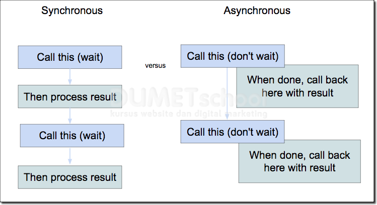

# Tugas 6
## Nama  : Teuku Gevin Taufan
## NPM   : 2106750194
## Kelas : PBP F
## Asdos : DRY

# Perbedaan Asynchronous dengan Synchronous di Programming
Synchronous adalah proses jalannya program secara sequential , disini yang dimaksud sequential ada berdasarkan antrian ekseskusi program.
Asynchronous adalah proses jalannya program bisa dilakukan secara bersamaan tanpa harus menunggu proses antrian.
dan ini adalah penjelasannya dan perbedaannya


# Event-Driven di JavaScript dan Ajax
Event-Driven itu kejadian pada sesuatu web seperti scrol, enter, click elemen, form disubmit atau bisa dibilang sesuatu hal user lakukan
bisa akan memunculkan sesuatu
pada tugas ini eventnya adalah ```onlick``` yaitu ketika ditekan button tersebut akan mengarah ke function ditentukan di oncliknya

ini event di tugas saya di todolist
```
...
'<a onclick="updateTask('+ value.pk +')">Update</a>'+
...
```

dan mengarah ke function
```
...
function updateTask(id) {
...
```

# Asynchronous Ajax
Ajax sendiri adalah Asynchronous JavaScript dan XML, cara kerjanya membuat web secara dinamis tanpa perlu reload
cara kerjanya pun sebagai berikut:
1. Browser akan memanggil AJAX javascript untuk mengaktifkan XMLHttpRequest dan mengirimkan HTTP Request ke server. 
2. XMLHttpRequest dibuat untuk proses pertukaran data di server secara asinkron.
3. Server menerima, memproses, dan mengirimkan data kembali ke browser.  
4. Browser menerima data tersebut dan langsung ditampilkan di halaman website, tanpa perlu reload atau membuat halaman baru. 

# Implementasi pada tugas tersebut
## Ajax GET
1. membuat view baru yaitu show_json untuk menampilkan data dalam bentuk show_json
2. membuat Url mengarah ke show_json supaya bisa di GET (```path('json/', show_json, name="show_json"),```)
3. dilakukan Ajax GET dari show_json tersebut

## Ajax POST
1. membuat add_task_ajax, delete_task_ajax, dan update_task_ajax di view untuk diperlukan di Ajax
2. menambahkan url 3 views tersebut 
``` 
path('add_task_ajax/', add_task_ajax, name='add_task_ajax'),
path('update_task_ajax/<int:id>', update_task_ajax, name='update_task_ajax'),
path('delete_task_ajax/<int:id>', delete_task_ajax, name='delete_task_ajax')
```
3. implementasi Ajax seperti di [todolist.html](https://github.com/TGevinT/tugas2/blob/main/todolist/templates/todolist.html)
4. juga ada penambahan modal untuk menambahkan task

# Sekian Terima Kasih 😊