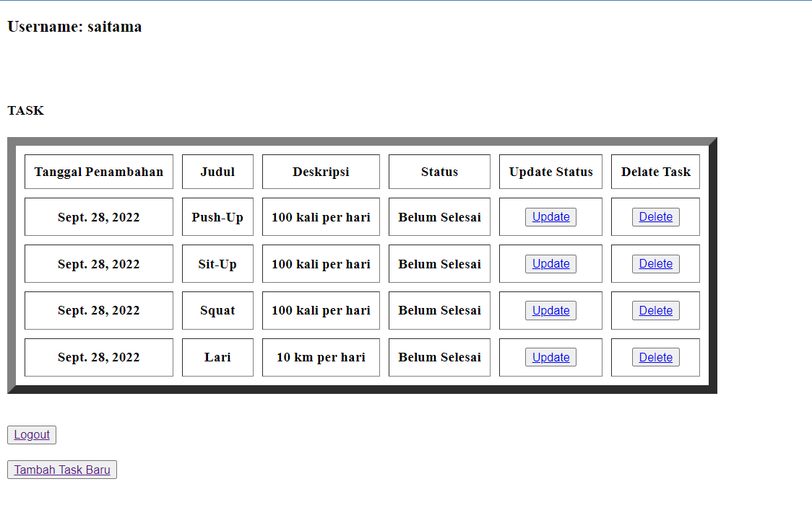
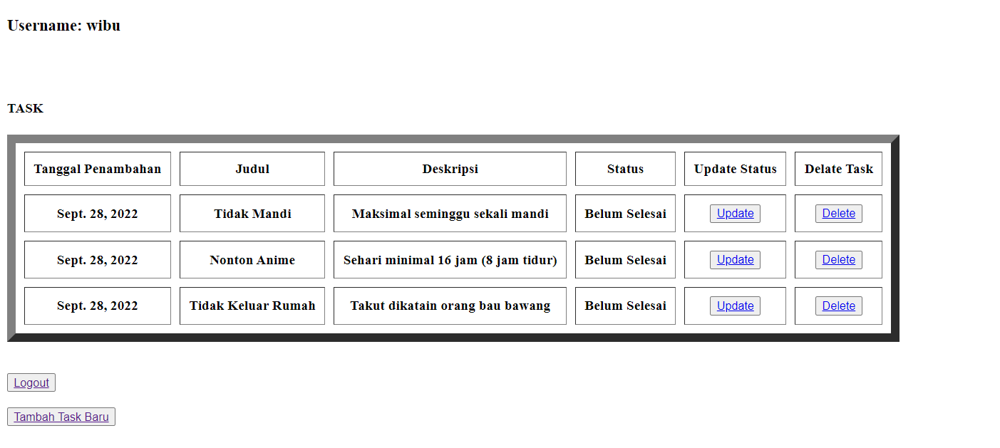

# Tugas 4
## Nama  : Teuku Gevin Taufan
## NPM   : 2106750194
## Kelas : PBP F
## Asdos : DRY

[Heroku Link todolist](https://tugas2teukugevin.herokuapp.com/todolist/)
<br>
username1 : saitama    pass1: onepunchman
<br>
username2 : wibu       pass2 : baubawang
<br> 

## Apa kegunaan `````` pada elemen ```<form>```? 
CSRF(Cross Site Request Forgery) adalah sebuah serangan yang membuat pengguna internet  tanpa sadar mengirimkan request (permintaan) kepada suatu 
aplikasi website melalui aplikasi website yang sedang digunakan. Jadi kegunaan `````` untuk menghindari serangan tersebut didalam
form. Cara kerjanya `````` akan membuat token sesaat terhubung pada halaman/web yang token tersebut berguna untuk menentukan apakah
permintaan tersebut berasal dari pengguna yang memiliki otoritas atau bukan.

##  Apa yang terjadi apabila tidak ada potongan kode tersebut pada elemen ```<form>```?
Ketika di selesai input pada form akan keluar 403 error karena tidak menemukan csrf token.

## Apakah kita dapat membuat elemen <form> secara manual (tanpa menggunakan generator seperti {{ form.as_table }})? 
Bisa, jadi kita buat langsung secara manual dengan method input di .html yang memerlukan form

## jelaskan secara gambaran besar bagaimana cara membuat secara manual.
Andaikan pada tugas tersebut ```create-task.html``` form dibuat secara manual (tidak memerlukan forms.py) dan perlu diganti juga
views.py class create_task beberapa


create-task.html(manual form)
```
...
<form method="POST" action="">
    
    <input type="text" placeholder="Title" name="title">
    <input type="text" placeholder="Description" name="description">
    <input type="submit" class="btn btn-primary" value="Create"></input>
</form>
...
```
di sini, ada input yang menyimpan nilainya dibuat secara manual

create_task class in views.py(manual form)
```
...
def create_task(request):
    if request.method == 'POST':
        title = request.POST.get('title')
        description = request.POST.get('description')
        task = Task.objects.create(title=title, description=description, user=request.user)
        task.save()
        return redirect('todolist:show_todolist')

    context = {}
    return render(request, 'create_task.html', context)
...
```
disini ditambahkan parameter title dan description untuk mengambil nilai d dapatkan dari input di ```create-task.html```

## Jelaskan proses alur data dari submisi yang dilakukan oleh pengguna melalui HTML form, penyimpanan data pada database, hingga munculnya data yang telah disimpan pada template HTML.
Sesudah user melakukan submisi atau perubahan dari html(web), data user tersebut akan ditranfer ke ```views.py``` menuju class mengeksekusi tugas perubahan yang diarahkan urls.py pattern.
Setelah itu, akan dibuat instance dari model baru dari hasil tranfer data user berdasarkan atribut yang tersimpan. Kemudian instance model tersebut akan di simpan di database. Dengan code khusu
instance-intance yang sudah ada akan diambil dari database dan ditampilkan ke html(web).

## Cara kamu mengimplementasikan checklist di atas
# Membuat suatu aplikasi baru bernama todolist di proyek tugas Django yang sudah digunakan sebelumnya
buka cmd, cd ke alamat tugas tersebut, melakukan ```env\Scripts\activate.bat``` sesudah itu jalankan ```python manage.py startapp todolist```.

### Menambahkan path todolist sehingga pengguna dapat mengakses http://localhost:8000/todolist.
di folder project_django, di settings.py, di INSTALLED_APPS tambahkan ```'todolist'```. Di urls.py di urlpatterns tambahkan ```path('todolist/', include('todolist.urls')),```

### Membuat sebuah model Task yang memiliki atribut sebagai berikut:
Bisa dilihat dari dari models.py di folder todolist atau klik [model.py](/model.py) dengan penambahan ```is_finished``` (bonus)
dan tidak lupa di cmd tadi jalankan ```python manage.py makemigrations``` dan  ```python manage.py migrate``` jika menambahkan dan membuat
model karena perlu diterapkan juga di databasenya

### Mengimplementasikan form registrasi, login, dan logout agar pengguna dapat menggunakan todolist dengan baik.
Bisa dilihat [views.py](/views.py) untuk logiknya, html untuk [login](/templates/login.html), dan html untuk [register](/templates/todolist.html)
class di views.py untuk login adalah ```login_user```, registrasi adalah ```register```, dan logout adalah ```logout_user```.


### Membuat halaman utama todolist yang memuat username pengguna, tombol Tambah Task Baru, tombol logout, serta tabel berisi tanggal pembuatan task, judul task, dan deskripsi task.
Bisa dilihat [todolist.html](/templates/todolist.html) implementasi todolist beserta bonusnya dan logika untuk mengirim datanya [views.py](/views.py), di class show_todolist

### Membuat halaman form untuk pembuatan task. Data yang perlu dimasukkan pengguna hanyalah judul task dan deskripsi task.
Bisa dilihat [create-task.html](/templates/create-task.html) implementasi pembuatan task, ada ```{{ form.as_p }}``` dari html tersebut yang di hasilkan dari [form.py](/forms.py)
dan logikan dari class create_task berada di [views.py](/views.py). logika tersebut untuk membuat instance baru dari input user dan menambahkannya ke data base, forms untuk 
menampilkan input apa saja yang diperlukan user, dan create-task.html tempat user melihatnya input apa saja yang diperlukan dan menginputnya.

### Membuat routing sehingga beberapa fungsi dapat diakses melalui URL berikut
Bisa dilihat di [urls.py](/urls.py) rooting semuanya yang bisa dibuka dari ```http://localhost:8000/todolist```

###  Melakukan deployment ke Heroku terhadap aplikasi yang sudah kamu buat sehingga nantinya dapat diakses oleh teman-temanmu melalui Internet.
Karena mengunakan repo sama dengan tugas-tugas sebelumnya jadi saya sudah melakukan deployment

### Membuat dua akun pengguna dan tiga dummy data menggunakan model Task pada akun masing-masing di situs web Heroku.
Akun 1 (Username : saitama, Password : onepunchman) dan Akun 2 (Username : wibu, Password : baubawang)

todolist.html akun 1 di web yang sudah di deployment di heroku


todolist.html akun 2 di web yang sudah di deployment di heroku


# Sekian Terima Kasih 😊